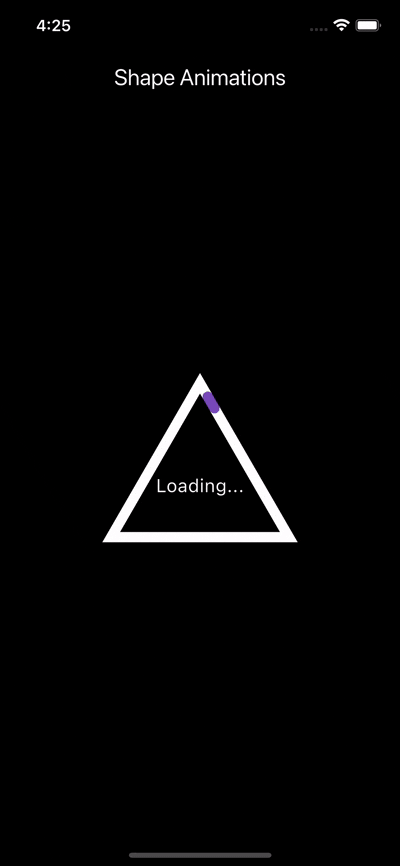
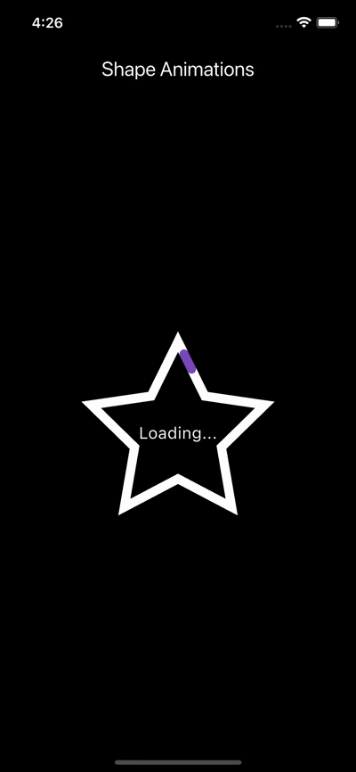
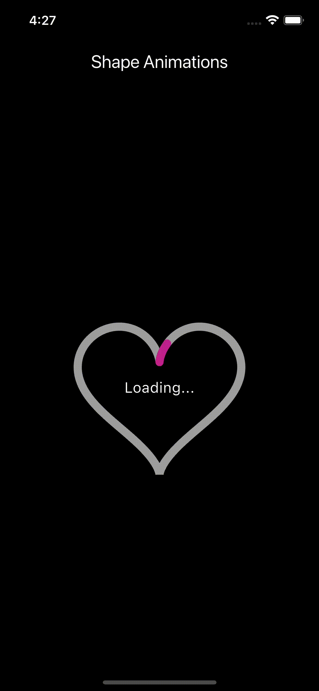
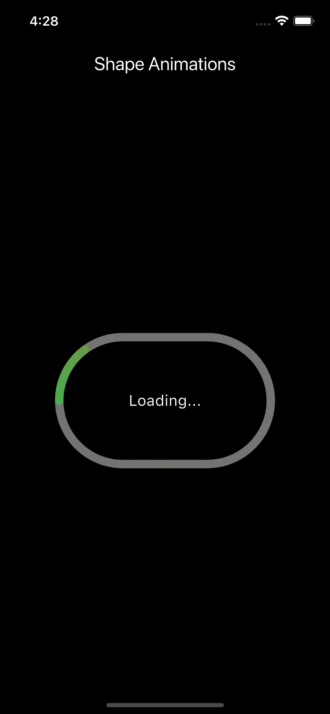
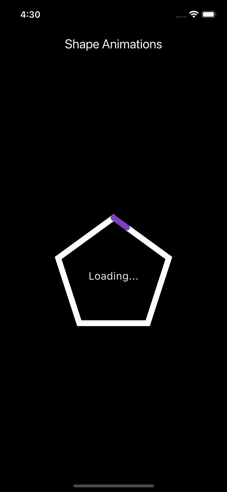
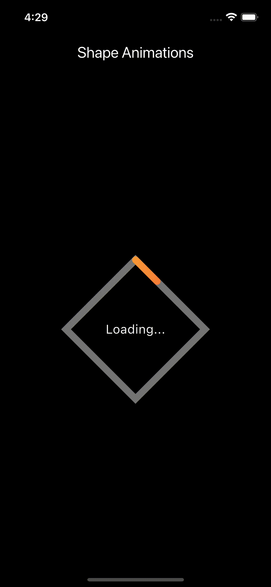
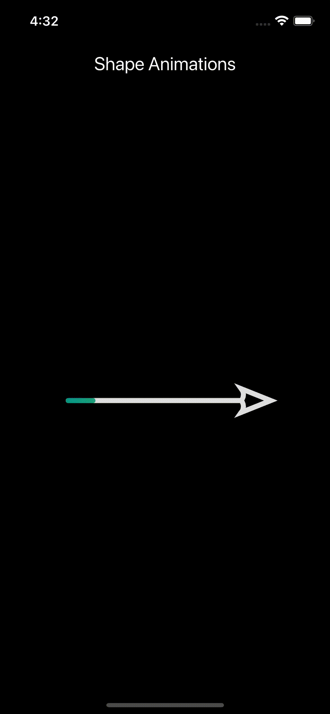
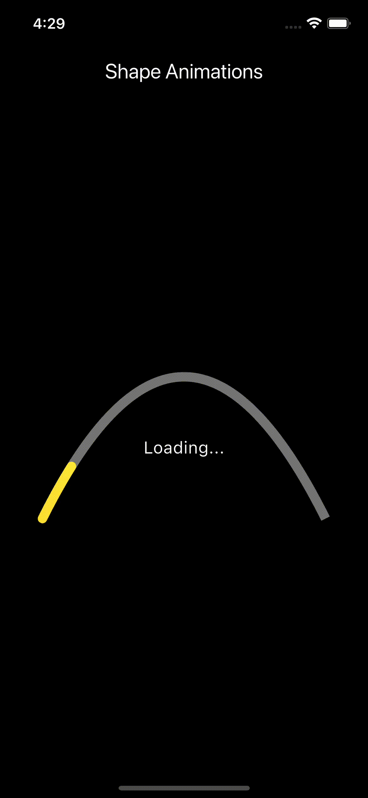

# shape_progress_bar

`shape_progress_bar` is a Flutter package that allows you to create animated progress borders around widgets in various shapes — including rectangles, triangles, stars, hearts, and more.

It supports customizable border colors, gradient animations, looping, glowing effects, and starting corner selection, making it perfect for progress indicators or decorative UI elements.

---

## ✨ Features

- Animate borders of widgets in common or custom shapes
- Control animation duration and progress direction
- Support for gradients and glowing border effects
- Customizable border width, glow width, and radius
- Looping animation support
- Fixed or animated progress value
- Start animation from a specific corner or edge

---

## 🧩 Supported Shapes

The package supports animated progress borders around the following shapes:

- ✅ Rectangle
- 🔺 Triangle
- ⭐ Star
- ❤️ Heart
- 🥚 Oval
- 📈 Parabola
- 💎 Diamond
- ⬟ Pentagon
- ➡️ Arrow (up, down, left, right)

You can also create **custom paths** to draw borders on virtually any shape.

---

## 📸 Preview

| Rectangle | Triangle | Star |
|----------|----------|------|
|  |  |  |

| Heart | Oval | Pentagon |
|-------|------|----------|
|  |  |  |

| Diamond | Arrow | Parabola |
|---------|-------|----------|
|  |  |  |

> ⚠️ Make sure these image paths match your project's `assets/images/` directory. If not, update them accordingly.

---

## 🚀 Installation

Add this to your `pubspec.yaml`:

```yaml
dependencies:
  shape_progress_bar: ^1.0.1
